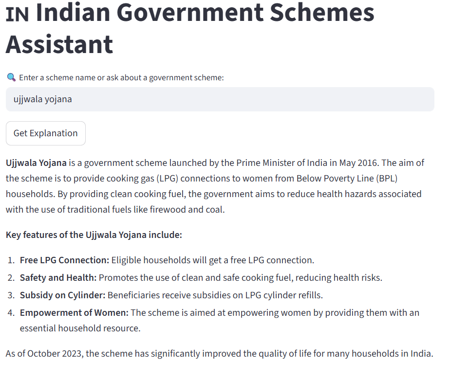
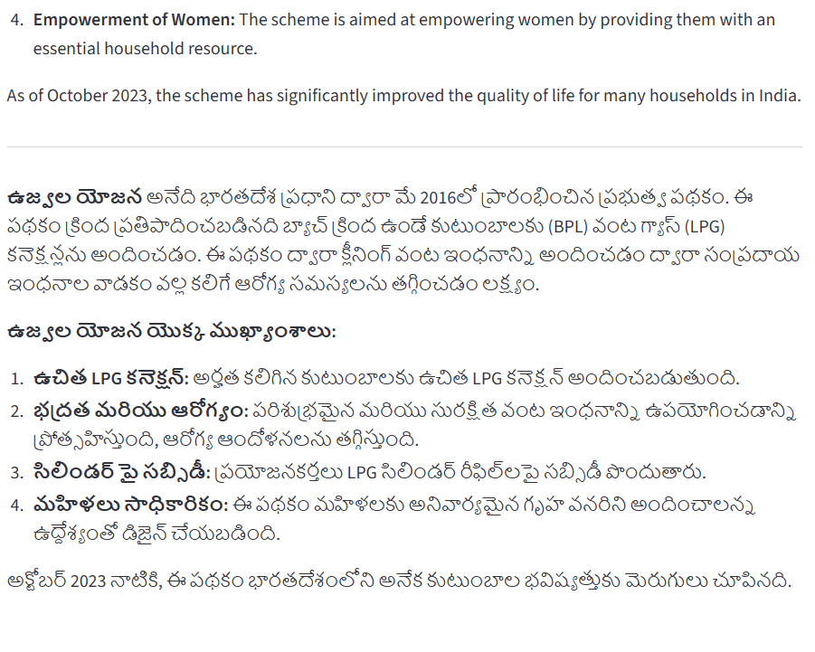

# Govt Schemes Assistant

Govt Schemes Assistant is a **Streamlit-based AI assistant** that helps users query and understand **Indian Government Schemes** in both **Telugu and English**.  
It is powered by **OpenAI’s GPT models** to provide accurate and easy-to-understand explanations.

**Problem It Solves**
Many citizens are unaware of government schemes or find it difficult to navigate official portals. This assistant provides **quick, accurate, and easy-to-understand information**, bridging the gap between government resources and the public.  
---

## 🌟 Features
- 🔍 Search and query Indian Government schemes ,Provides details about eligibility, benefits,  and application process .
- 🌐 Bilingual support — **Telugu** and **English**.
- ⚡ Simple and interactive **Streamlit UI**.
- 🔑 Secure API key handling via `.env` file.
- 📱 Lightweight and easy to run locally.

## 📸 Demo

**English Output:**  


**Telugu Output:**  



---

## 🛠️ Tech Stack
- **Python 3.9+**
- **Streamlit**
- **OpenAI GPT-4o-mini**
- **dotenv** for environment management
- **Other Python libraries** (see `requirements.txt`)

---


## Setup & Installation
1. Clone the repository:
```bash
git clone https://github.com/Kruthihamsika/Govt-schemes-assistant.git


